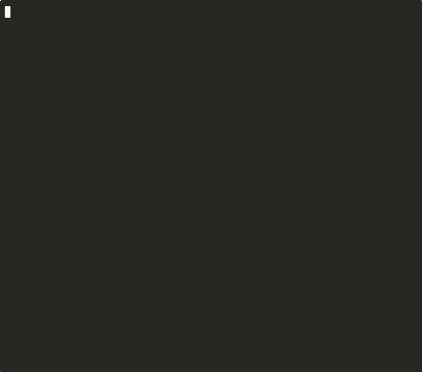

# Banana Browser

**Stealth browser automation that bypasses bot detection.**

[](https://www.npmjs.com/package/banana-browser)
[](https://www.npmjs.com/package/banana-browser)
[](https://github.com/vercel-labs/agent-browser/blob/main/LICENSE)
[](https://github.com/vercel-labs/agent-browser)

---

<p align="center">
  
</p>

---

## Try It Now

```bash
npx banana-browser demo
```

That's it. Watch your browser pass every bot detection test.

---

## What It Does

Banana Browser is a headless Chrome that's **invisible to bot detection**. It uses Patchright (an undetectable Playwright fork) to pass fingerprint checks, Cloudflare, and anti-bot systems that block regular automation tools.

Perfect for AI agents, web scraping, and automation that needs to look human.

---

## Installation

### Quick Install (recommended)

```bash
npm install -g banana-browser
```

The native Rust binary downloads automatically. Then install Chrome:

```bash
banana-browser install
```

### One-liner Demo (no install needed)

```bash
npx banana-browser demo
```

### From Source

```bash
git clone https://github.com/vercel-labs/agent-browser
cd agent-browser
npm install
npm run build:native   # Requires Rust
```

---

## Quick Start

### Run the Bot Detection Demo

```bash
banana-browser demo
```

Opens a browser, navigates to bot detection tests, and shows you the results in your terminal.

### Start the Browser Daemon

```bash
banana-browser start
```

### Navigate to a URL

```bash
banana-browser open https://example.com
```

### Take a Screenshot

```bash
banana-browser screenshot https://example.com -o screenshot.png
```

### Check Your Setup

```bash
banana-browser --version
```

---

## Features

- **Undetectable** - Passes Cloudflare, DataDome, PerimeterX, and fingerprint tests
- **Fast** - Native Rust CLI, no Node.js runtime overhead for the daemon
- **Simple** - Single binary, zero configuration required
- **AI-Ready** - Built for AI agents with structured output and MCP integration
- **Cross-Platform** - Works on macOS (Intel + ARM), Linux, and Windows

---

## Comparison: Regular Automation vs Banana Browser

| Bot Detection Test | Puppeteer | Playwright | Banana Browser |
|--------------------|-----------|------------|----------------|
| navigator.webdriver | FAIL | FAIL | PASS |
| Chrome headless detection | FAIL | FAIL | PASS |
| Fingerprint consistency | FAIL | FAIL | PASS |
| Cloudflare challenge | FAIL | FAIL | PASS |
| DataDome | FAIL | FAIL | PASS |

---

## CLI Commands

### Core Commands

| Command | Description |
|---------|-------------|
| `banana-browser demo` | Run bot detection tests and show results |
| `banana-browser install` | Install Chromium for automation |
| `banana-browser open <url>` | Navigate to a URL |
| `banana-browser screenshot [path]` | Take a screenshot |
| `banana-browser close` | Close the browser |
| `banana-browser --version` | Show version info |
| `banana-browser --help` | Show all commands |

### Interaction Commands

| Command | Description |
|---------|-------------|
| `banana-browser click <selector>` | Click an element |
| `banana-browser fill <selector> <text>` | Fill a form field |
| `banana-browser type <text>` | Type text into focused element |

### Demo Options

| Option | Description |
|--------|-------------|
| `--headless` | Run demo in headless mode |
| `--quiet` | Suppress promotional output |
| `--screenshot <path>` | Save screenshot of results |

### Environment Variables

| Variable | Description |
|----------|-------------|
| `AGENT_BROWSER_ENGINE=patchright` | Use Patchright anti-detection engine |
| `AGENT_BROWSER_HEADLESS=true` | Run in headless mode |

### Examples

```bash
# Run the bot detection demo
banana-browser demo

# Open a page with anti-detection
AGENT_BROWSER_ENGINE=patchright banana-browser open https://bot.sannysoft.com

# Automate a form
banana-browser open https://example.com/form
banana-browser fill "#email" "user@example.com"
banana-browser fill "#password" "secret"
banana-browser click "button[type=submit]"
banana-browser screenshot result.png
```

---

## Documentation

- [Full Documentation](https://github.com/vercel-labs/agent-browser/tree/main/docs)
- [MCP Skills Guide](https://github.com/vercel-labs/agent-browser/tree/main/skills)
- [API Reference](https://github.com/vercel-labs/agent-browser/tree/main/docs)

---

## Contributing

We welcome contributions! See [CONTRIBUTING.md](CONTRIBUTING.md) for guidelines.

```bash
git clone https://github.com/vercel-labs/agent-browser
cd agent-browser
npm install
npm run dev:setup
```

---

## License

Apache-2.0 - See [LICENSE](LICENSE) for details.

---

<p align="center">
  <strong>If this saves you time, consider giving us a star!</strong>
  <br>
  <a href="https://github.com/vercel-labs/agent-browser">Star on GitHub</a>
</p>
